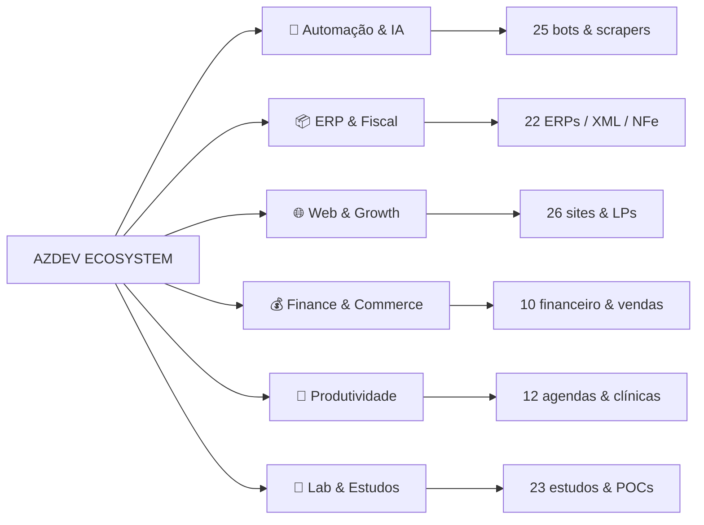

<p align="center">
  <a href="https://github.com/azdevcoder">
    
  </a>
</p>

<p align="center">
  <a href="https://github.com/azdevcoder"></a>
  <!-- -->
  
  
</p>

<p align="center">
  <a href="https://portfolio.azdevcoder.com.br"></a>
  <a href="https://www.linkedin.com/in/andr%C3%A9-zago-azdevcoder/"></a>
  <a href="mailto:contato@azdevcoder.com.br"></a>
</p>

---

### // MANIFESTO

```py
class AzDevCoder:
    def __init__(self):
        self.nome = "André Zago"
        self.background = "10+ anos em Gestão Comercial & Administrativo"
        self.missao = "Transformar processo manual em sistema que escala"
        self.stack_mentalidade = ["visão de negócio", "código limpo", "automação obsessiva"]

    def build(self, ideia):
        return self.entender_negocio(ideia) >> self.prototipar() >> self.automatizar() >> self.entregar()
```

> **Não faço site bonito. Faço sistema que tira trabalho da sua mesa.**
> De planilha caótica → ERP. De atendimento manual → bot. De XML perdido → dashboard.

<br>

<table align="center">
<tr>
<td align="center" width="180"><h3>118+</h3><sub>PROJETOS LOCAIS</sub><br><sub>em <code>PROJETOS/</code></sub></td>
<td align="center" width="180"><h3>60</h3><sub>REPOS PÚBLICOS</sub><br><sub>no GitHub</sub></td>
<td align="center" width="180"><h3>19</h3><sub>LABS OPENCODE</sub><br><sub>clones & forks de referência</sub></td>
<td align="center" width="180"><h3>6</h3><sub>VERTICAIS</sub><br><sub>do bot ao ERP fiscal</sub></td>
</tr>
</table>

---

### // STACK REAL — O QUE RODA EM PRODUÇÃO

<p align="center">
  
</p>

<p align="center">
  
  
  
  
  
  
</p>

<details>
<summary><b>▸ ver formação completa</b></summary>

- **Pós:** Inteligência Artificial | Engenharia de Software
- **Graduação:** Análise e Desenvolvimento de Sistemas | Gestão Comercial
- **Explorando agora:** Hardware embarcado (Arduino), Linux em SBC (RK322X / MXQ Pro 5K), LLM local com Ollama, voz com mini-computador Opencode

</details>

---

### // ECOSSISTEMA — 6 VERTICAIS

> Mapeado direto de `C:\Users\PC\Desktop\PROJETOS` (118 pastas) + `opencode` (19 labs) — sem mock.



#### 🤖 01 — AUTOMAÇÃO & IA — 25 projetos
O coração da AzDev. Onde planilha vira pipeline.

| Projeto | O que faz | Stack |
| :--- | :--- | :--- |
| **bot_splits** | Bot WhatsApp que vende splits de perfume com Google Sheets como DB | Baileys, Node, Google API |
| **meu_bot_nfe** | Orquestrador de NFe (selecionar, captcha, instalar, deletar) — 8 bots | Python, Playwright |
| **agente_atendimento** | Agente IA de pré-atendimento com RAG | Python, LLM |
| **agente_audio** | Transcrição e resposta por áudio | Python |
| **assistente_pessoal** | Assistente com `conhecimento.json` local | Python 12k+ linhas |
| **megabrain** | Cérebro central — 5k+ linhas de automação | Python |
| **bot_leads / coleta_leads / analisador_leads** | Tríade de captura → análise → disparo | Python |
| **disparos / atendimento_zapcoder / chatbot-azdevcoder** | Fluxos de WhatsApp & chat IA | Python, JS |
| **busca_lead / busca_vagas / email_linkedin** | Prospecção automatizada | Python |
| **coleta_xml / extrator_xml / extrator_pdf / desmembrar_xml / convert_pdf-xml** | Pipeline fiscal completo: coleta → extrai → converte | Python, JS |

#### 📦 02 — ERP & FISCAL — 22 projetos
De `SPED.txt → XLSX` até controle de documentos. Feito pra quem vive de nota.

| Projeto | O que faz |
| :--- | :--- |
| **mini_erp / sistema_controle / sistema pedidos / sistemas_unificados** | ERPs modulares (estoque, pedidos, unificação) |
| **pdv** | PDV completo com emissor fiscal |
| **sistema_consulta_pedidos / unionsystem / consulta_xml / consulta_pedidos** | Integração Protheus / Union System |
| **sped_txt-xlsx / cod_municipio / SISTEMA DE CONTROLE DE DOCUMENTOS** | Conversores fiscais & compliance |
| **Z-orbital-crm / mini-crm-saas / crm / leads_dashboard** | CRMs B2B com Kanban, TRPC, Drizzle, AWS S3 |
| **controle_entrada / controle_uso_veicular** | Controle operacional |

#### 🌐 03 — WEB & GROWTH — 26 projetos
Landing que converte, site que ranqueia.

`site-azdevcoder` · `site_psicogiovanaandretto` · `site_giovanamorais` · `site_produtos_afiliados` · `sistema_giovana-main` · `sistema_web_fitness` · `uniao_maringa` · `lp_sites` (13 LPs) · `gerador_sites_afiliados` · `landing_ebook` · `convite` (RSVP + presentes) · `meus_links` · `visual_ecommerce` · `hashtag` · `Inativos` · `proposta_comercial` (React + jspdf + html-to-image)

> Destaque: **scanner_seo-cro** — auditor SEO/CRO com Python + análise de página.

#### 💰 04 — FINANCE & COMMERCE — 10 projetos
| Projeto | Foco |
| :--- | :--- |
| **gerenciador_financeiro** | Dashboard financeiro com backup JSON |
| **dashboard_vendas / visual_ecommerce** | Visão de vendas Nutrigenes |
| **calculo_custo / calculo_venda / conversor_moeda** | Precificação & câmbio |
| **emissor_recibos / proposta_comercial** | Documentos comerciais |
| **consulta_fipe / tabela_copa_2026** | Utilidades web |

#### 📅 05 — PRODUTIVIDADE & SAÚDE — 12 projetos
`agenda_salas` · `agendamento_pacientes` (clínica) · `sistema_clinica` · `sistema_cta` · `cronograma_semanal` · `planner` (Express) · `planner_metas` · `curriculo_azdevcoder` — todos com HTML/JS vanilla focado em simplicidade e velocidade.

#### 🧪 06 — LAB & ESTUDOS — 23 projetos
`Algoritmos_logica_programacao` · `estrutura_dados` · `python_dev` (3.5k linhas) · `python_ia` (10k) · `python_insights` (4.3k) · `python_powerup` · `api_azdevcoder_ML` · `remix-bergmann` (React + Gemini) · `games_farmer` · `projeto_teste_db` · `testes` — campo de prova antes de ir pra prod.

---

### // OPENCODE LAB — 19 CLONES DE REFERÊNCIA

> Pasta `Desktop/opencode` — meu playground de engenharia reversa. Não são meus, mas estudo como se fossem.

| Lab | Por que está aqui |
| :--- | :--- |
| **awesome-llm-apps / awesome-mcp-servers / langflow / ollama / openhands** | Stack LLM local & agentes |
| **scrapling / public-apis / free-for-dev** | Scraping & APIs free |
| **open-design / interface_consulta (Protheus Data Lab)** | Design system + dashboard dark Flask+Pandas |
| **emulador_android / apk / RK322X-Armbian / mxq-pro-5k / mini-computador-opencode-voz** | Hardware + Android + SBC Linux |
| **awesome / backup_opencode / opencode_arquivos** | Curadoria & backup |

---

### // PROJETOS EM DESTAQUE — TOP 9

<table>
<tr>
<td width="33%" valign="top">

**🤖 Bot Splits**
<br><sub>WhatsApp + Sheets</sub><br>
Baileys · Google API · QR<br>
<a href="https://github.com/azdevcoder/bot_whatsapp">→ ver repo</a> · `PROJETOS/bot_splits`

</td>
<td width="33%" valign="top">

**📊 Orbital CRM**
<br><sub>Leads B2B Kanban</sub><br>
Next · TRPC · Drizzle · S3<br>
<a href="https://github.com/azdevcoder/orbital-leads-crm">→ ver repo</a> · `Z-orbital-crm`

</td>
<td width="33%" valign="top">

**🧾 Pipeline Fiscal**
<br><sub>XML → Dashboard</sub><br>
Python · Playwright · Pandas<br>
`coleta_xml` + `extrator_xml` + `sped_txt-xlsx`

</td>
</tr>
<tr>
<td width="33%" valign="top">

**🛒 PDV + Emissor**
<br><sub>Frente de caixa fiscal</sub><br>
Python · SQLite<br>
`PROJETOS/pdv` — 1.4k linhas

</td>
<td width="33%" valign="top">

**💬 Agente IA 24h**
<br><sub>Atendimento + Áudio</sub><br>
Python · Whisper · LLM<br>
`agente_atendimento` + `agente_audio`

</td>
<td width="33%" valign="top">

**🌐 Scanner SEO/CRO**
<br><sub>Auditoria automática</sub><br>
Python · 2.8k linhas<br>
`scanner_seo-cro`

</td>
</tr>
<tr>
<td width="33%" valign="top">

**📅 Clínica OS**
<br><sub>Agenda + Prontuário</sub><br>
JS · HTML · 9 páginas<br>
`sistema_clinica` + `agendamento_pacientes`

</td>
<td width="33%" valign="top">

**💰 Gerenciador Financeiro**
<br><sub>Fluxo de caixa</sub><br>
HTML · JSON backup<br>
`gerenciador_financeiro`

</td>
<td width="33%" valign="top">

**🎨 Interface Consulta**
<br><sub>Protheus Data Lab</sub><br>
Flask · Pandas · Dark UI<br>
<a href="https://github.com/azdevcoder/interface_consulta">→ ver repo</a> · `opencode/interface_consulta`

</td>
</tr>
</table>

---

### // GITHUB EM TEMPO REAL

<p align="center">
 
</p>
<p align="center">
  
</p>

<p align="center">
  
</p>

---

### // ATIVIDADE

<!-- Snake - auto gerado por .github/workflows/snake.yml para branch output -->
<p align="center">
  <picture>
    <source media="(prefers-color-scheme: dark)" srcset="https://raw.githubusercontent.com/azdevcoder/azdevcoder/output/github-contribution-grid-snake-dark.svg" />
    <source media="(prefers-color-scheme: light)" srcset="https://raw.githubusercontent.com/azdevcoder/azdevcoder/output/github-contribution-grid-snake.svg" />
    
  </picture>
</p>

<p align="center"><sub>🐍 Gerado automaticamente por <code>.github/workflows/snake.yml</code> → branch <code>output</code> | atualiza a cada 6h + a cada push em <code>main</code></sub></p>

---

### // COMO TRABALHO

|  |  |
| :--- | :--- |
| **01 — Entendo o processo** | 10 anos de administrativo me ensinaram: código sem contexto de negócio é bug futuro. Mapeio a dor antes do `npm init`. |
| **02 — Automatizo o chato** | Se repete 3x, vira bot. Playwright, API, Sheets, WhatsApp — o que tirar humano de tarefa robótica. |
| **03 — Entrego simples** | HTML/JS quando resolve. React/TRPC quando precisa escalar. Sem over-engineering. |
| **04 — Documento & ensino** | `Algoritmos_logica_programacao`, `python_ia`, artigos — se não dá pra explicar, não dá pra manter. |

---

### // TODOS OS 118 PROJETOS — LISTA COMPLETA

<details>
<summary><b>▸ clique para expandir — PROJETOS/ (118)</b></summary>

```
agenda_salas               agente_atendimento         agente_audio
Algoritmos_logica          analisador_leads           API
api_azdevcoder_ML          APP                        assinatura_contrato
assinatura_contratos       assistente_pessoal         atendimento_zapcoder
azdev_notes                bot_leads                  bot_mercadopago
bot_splits                 bot_webmais                busca_lead
busca_vagas                calculo_custo              calculo_venda
chatbot-azdevcoder         cod_municipio              coleta_leads
coleta_xml                 consulta_fipe              consulta_pedidos
consulta_xml               controle_entrada           controle_uso_veicular
conversor_moeda            convert_pdf-xml            convite
crm                        cronograma_semanal         csi
curriculo_azdevcoder       dashboard_vendas           desmembrar_xml
disparos                   email_linkedin             emissor_recibos
estrutura_dados            extrator_pdf               extrator_xml
games_farmer               gerador_sites_afiliados    gerenciador_financeiro
hashtag                    Inativos                   landing_ebook
landingpage_ebook          leads_dashboard            lp_sites
megabrain                  meus_links                 meu_bot_nfe
mini_erp                   mini-crm-saas              money_printerturbo
mvp                        nova_empresa               novo_bot
pdv                        planner                    planner_metas
procurações                projeto_PHP                projeto_teste_db
proposta_comercial         propostas_comerciais       psigiovana-main
python_dev                 python_ia                  python_insights
python_powerup             remix-bergmann             scanner_seo-cro
simulado_sgsistemas        SISTEMA DE CONTROLE DOCS   sistema pedidos
sistema_clinica            sistema_consulta_pedidos   sistema_consulta_unionsystem
sistema_controle           sistema_controle_psi       sistema_cta
sistema_giovana-main       sistema_proposta           sistema_web_fitness
site-azdevcoder            sites_prospeccoes          site_giovanamorais
site_produtos_afiliados    site_psicogiovana          smart_contabilidade
sped_txt-xlsx              tabela_copa_2026           tela_login
testes                     test_py                    uniao_maringa
unificados_azdevcoder      vagas                      visual_ecommerce
Z-orbital-crm
```

</details>

<details>
<summary><b>▸ clique para expandir — 60 REPOS PÚBLICOS</b></summary>

`api_azdevcoder` · `azcep.github.io` · `azdevcoder` · `azdevcoder_notes` · `bot_whatsapp` · `busca_lead` · `calculadora_venda` · `chat_atendimento_ia` · `chat_pre_atendimento` · `contratos_giovana` · `controle_procuracoes` · `crm_leads` · `cronograma` · `csi` · `curriculo` · `dashboard_nutrigenes` · `dcomp_CTA` · `disparos_leads` · `edilene_doces` · `emulador_android` · `gerenciador-financeiro` · `giovana-fitness` · `importa_xml` · `interface_consulta` · `lancamento_entrada` · `leads-dashboard` · `links` · `login` · `nathricco` · `new-site-azdevcoder` · `orbital-leads-crm` · `planner-metas` · `portfolio_landingpages` · `projeto_teste_db` · `proposta_comercial` · `simulado-sgsistemas` · `sistemas_nutrigenes` · `sistema_controle` · `smart_contabilidade` · `uniao_maringa` · `xml_export` · ... +20

</details>

<details>
<summary><b>▸ clique para expandir — OPENCODE LABS (19)</b></summary>

`awesome-llm-apps` · `awesome-mcp-servers` · `awesome` · `free-for-dev` · `public-apis` · `open-design` · `openhands` · `langflow` · `ollama` · `scrapling` · `emulador_android` · `apk` · `RK322X-Armbian-Home-Server` · `mxq-pro-5k-opencode` · `mini-computador-opencode-voz` · `bot_splits` · `interface_consulta` · `opencode_arquivos` · `backup_opencode`

</details>

---

<p align="center">
  <a href="https://portfolio.azdevcoder.com.br"></a>
</p>

<p align="center">
  <sub>📍 Maringá — PR · Aberto a freelas, parcerias e code review</sub><br>
  <sub>Se algum projeto te interessou, abre uma issue ou me chama no <a href="https://www.linkedin.com/in/andr%C3%A9-zago-azdevcoder/">LinkedIn</a> — respondo em < 24h</sub>
</p>


